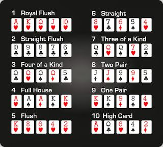

# Session 5 - First Class Functions

### [Class Notebook](https://github.com/abdksyed/EPAi2/blob/main/Session04_Numeric_Types_II/notebooks/Session%204%20-%20Numerical%20Types%20II%20And%20Functions.ipynb)
Click on **Open in Colab** for hands-on.

### Topic Covered:

* #### Default Values
* #### Docstrings and Annotations
* #### Lambda Expressions
* #### Fucntional Introspection
* #### Callables
* #### Map, Filter and Zip
* #### Reducing Functions
* #### Partial Functions
* #### The Operator Module
  
  
# Assignment 5(a)

## Assignment Objective - Game of Poker.

This is a fun assignment, where we need to check, according to the rules of Pokers, which of the player hand of cards wins. The winner is decided on the basis of rank allotted according to the following sequence:



But first we need to create a deck of cards, right? Let's start from the beginning.

### Creating the deck


Method 1:

```python
deck_lam = list(map(lambda x: (x[0], x[1]), zip(vals*4, suits*13)))
```

Method 2:

```python
def create_deck(vals: 'List/Set of Values',
                suits: 'List/Set of Suits',
                number_of_decks: 'Total Number of Decks to be Used' = 1) -> 'Set of Deck':
    '''
    A function which creates a deck of playing cards.
    Inputs:
    vals: The values of cards of each suit.
    suits: The diffrent suits of cards.
    number_of_decks: Number of decks to be used.
    Returns:
    deck: Set of Cards.
    '''
    deck = set()
    for _ in range(number_of_decks):
        for suit in suits:
            for val in vals:
                deck.add((val, suit))
    return deck
```

### Checking the rank

Next, to declare a winner, we need to find the rank of the card sets with each player and then decide on the winner. To reduce the complexity, in this section, we discuss the function whose task is to just return the rank according to the rules. All the checks on the cards will be performed by the function which calls this and we would discuss that one in the coming section.

Let's look at the function.

```python
def royal_flush(hand):
    '''
    Check if hand is a Royal Flush.
    Input: The set of card - hand
    Output:
    If True, Return (Rank:1, string), (14)
    If False, Return False, None
    '''
    val = [x[0] for x in hand]
    suit = [x[1] for x in hand]
    royal_flush = ['ace', 'king', 'queen', 'jack', '10']
    if len(set(suit)) != 1:
        return False, None
    k = 0
    for i in range(len(hand)):
        if val[i] in royal_flush[:len(hand)]:
            k += 1
    if k == len(hand):
        return (1, 'WOW!!!!. You got a "ROYALLLLLLL FLUSH!"(Rank:1)'), (14,)
    return False, None


def straight_flush(hand):
    '''
    Check if hand is a Straight Flush.
    Input: The set of card - hand
    Output:
    If True, Return (Rank:2, string), (Descending Order of Card Values)
    If False, Return False, None
    '''
    flu, _ = flush(hand)
    stra, num = straight(hand)
    if flu and stra:
        return (2, 'You are Amazing, its a "STRAIGHT FLUSH!!!!"(Rank:2)'), (num,)
    return False, None


def four_kind(hand):
    '''
    Check if hand is a Four of a Kind.
    Input: The set of card - hand
    Output:
    If True, Return (Rank:3, string), (Card Value)
    If False, Return False, None
    '''
    val = [conv_card_to_num(x[0]) for x in hand]
    suit = [x[1] for x in hand]
    if len(set(suit)) != 4:
        return False, None
    dict_val = {i: val.count(i) for i in val}
    for k, v in dict_val.items():
        if v == 4:
            return (3, 'You have all suits of a card, "FOUR OF A KIND"(Rank:3)'), (k,)
    return False, None


def full_house(hand):
    '''
    Check if hand is a Full House.
    Input: The set of card - hand
    Output:
    If True, Return (Rank:4, string), (Three Kind Card Value, Pair Card Value)
    If False, Return False, None
    '''
    thr, num_3 = three_kind(hand)
    op, num_2 = one_pair(hand)
    if thr and op:
        return (4, 'That is a "FULL HOUSE(Rank:4)"'), (num_3[0], num_2[0])
    return False, None


def flush(hand):
    '''
    Check if hand is a Flush.
    Input: The set of card - hand
    Output:
    If True, Return (Rank:5, string), (Descending Order of Card Values)
    If False, Return False, None
    '''
    val = [conv_card_to_num(x[0]) for x in hand]
    val.sort()
    suit = [x[1] for x in hand]
    if len(set(suit)) != 1:
        return False, None
    return (5, 'You "FLUSHed it"(Rank:5)'), tuple(val[::-1])


def straight(hand):
    '''
    Check if hand is a Straight.
    Input: The set of card - hand
    Output:
    If True, Return (Rank:6, string), (Descending Order of Card Values)
    If False, Return False, None
    '''
    val = [conv_card_to_num(x[0]) for x in hand]
    val.sort()
    k = 0
    for i in range(len(hand)-1):
        if val[i] == val[i+1]-1:
            k += 1
    if k == len(hand)-1:
        return (6, 'What a "STRAIGHT" drive(RANK:6)'), tuple(val[::-1])
    return False, None


def three_kind(hand):
    '''
    Check if hand is a Three of a Kind.
    Input: The set of card - hand
    Output:
    If True, Return (Rank:7, string), (Three Kind Card Value,)
    If False, Return False, None
    '''
    val = [conv_card_to_num(x[0]) for x in hand]
    suit = [x[1] for x in hand]
    if len(set(suit)) < 3:
        return False, None
    dict_val = {i: val.count(i) for i in val}
    for k, v in dict_val.items():
        if v == 3:
            return (7, 'Go for 3, "THREE OF A KIND"(Rank:7)'), (k,)
    return False, None


def two_pair(hand):
    '''
    Check if hand is a Two Pairs.
    Input: The set of card - hand
    Output:
    If True, Return (Rank:8, string), (Higher Pair Value, Lower Pair Value, Final Card Value)
    If False, Return False, None
    '''
    p1, n1 = one_pair(hand)
    if not p1:
        return False, None
    left_over_hand = [x for x in hand if conv_card_to_num(x[0]) != n1[0]]
    p2, n2 = one_pair(left_over_hand)
    if p1 and p2:
        final_card_val = [conv_card_to_num(
            x[0]) for x in left_over_hand if conv_card_to_num(x[0]) != n2[0]]
        return (8, 'This is good, "TWO PAIRS" haan (Rank:8)'), (max(n1[0], n2[0]), min(n1[0], n2[0]), *final_card_val)
    return False, None


def one_pair(hand):
    '''
    Check if hand is a One Pair.
    Input: The set of card - hand
    Output:
    If True, Return (Rank:9, string), (Pair Card Value, Descending Order of Remaining Card Values)
    If False, Return False, None
    '''
    val = [conv_card_to_num(x[0]) for x in hand]
    val.sort()
    dict_val = {i: val.count(i) for i in val}
    for k, v in dict_val.items():
        if v == 2:
            left_over_val = [conv_card_to_num(
                x[0]) for x in hand if conv_card_to_num(x[0]) != k]
            left_over_val.sort()
            return (9, 'Good! It is a "PAIR"(Rank:9)'), (k, *left_over_val[::-1])
    return False, None


def high_card(hand):
    '''
    Input: The set of card - hand
    Output:
    Return (Rank:10, string), (Descending Order of Card Values)
    '''
    val = [conv_card_to_num(x[0]) for x in hand]
    val.sort()
    return (10, f'Only hope is your High Card must be good enough(Rank:10)'), tuple(val[::-1])
```

#### This functions not only returns the rank, but also returns the card values in proper orders in the set to help in tie braking, if required.

### Misc Functions:

This function converts the Jack, Quen, King and Ace to respective values of 11, 12, 13 and 14.
```python
def conv_card_to_num(card: 'Value of the Card in String') -> 'Value of Card in int':
    '''
    Convert the Card to an integer value.
    Argument: card of str type
    Returns: The integer value of the card.
    '''
    if card == 'ace':
        return 14
    if card == 'king':
        return 13
    if card == 'queen':
        return 12
    if card == 'jack':
        return 11
    return int(card)
```

This function creates two random players, with each player holding either 3/4/5 cards.
```python
def create_player(deck, cards_per_player=5):
    print('----SHUFFLING---')
    p1_hand = random.sample(tuple(deck), cards_per_player)
    p2_hand = random.sample(tuple(deck-set(p1_hand)), cards_per_player)
    print('----Lightening Speed Distribution Later---')
    print('Hey P1, you got: ', p1_hand)
    print('Hey P2, you got: ', p2_hand)
    print('------------------------------------------')

    return p1_hand, p2_hand
```

### Who's the winner!

The Final function, to check who is the winner based on the hand (set of cards) the player gets.  
The function first sets the win cases according to the number fo cards per player.  
Then for each rank in win cases, the hand is passed and checked if it holds the patterns from Rank 1 to 10, and it stops checking if it find the rank, or else at last Rank 10 is assigned.

```python
def winner(p1_hand, p2_hand):
    win_cases = {
        5: [royal_flush, straight_flush, four_kind, full_house, flush, straight, three_kind, two_pair, one_pair, high_card],
        4: [royal_flush, straight_flush, four_kind, flush, straight, three_kind, two_pair, one_pair, high_card],
        3: [royal_flush, straight_flush, flush, straight, three_kind, one_pair, high_card]
    }
    if len(p1_hand) != len(p2_hand):
        raise ValueError('Unequal Number of Cards for P1 and P2')
    cards_per_player = len(p1_hand)
    win_case = win_cases[cards_per_player]
    p1_rank, p2_rank = 0, 0

    for case in win_case:
        if not p1_rank:
            p1_res = case(p1_hand)
            if p1_res[0]:
                p1_rank = p1_res[0][0]
                p1_stat = p1_res[0][1]
                p1_high = p1_res[1]
        if not p2_rank:
            p2_res = case(p2_hand)
            if p2_res[0]:
                p2_rank = p2_res[0][0]
                p2_stat = p2_res[0][1]
                p2_high = p2_res[1]

    print(f'Hey P1: {p1_stat}, with order of highest cards as: {p1_high}')
    print(f'Hey P2: {p2_stat}, with order of highest cards as: {p2_high}')
    print('------------------------------------------')
    if p1_rank < p2_rank:
        return f'Congratulations Player 1, you WON! as you had better hand.'
    elif p1_rank > p2_rank:
        return f'Congratulations Player 2, you WON! as you had better hand.'
    else:
        print('---TIE BREAKER CHECK:---')
        for p1_c, p2_c in zip(p1_high, p2_high):
            if p1_c > p2_c:
                return f'Congratulations Player 1, you have Won! as you had better high card {p1_c} than {p2_c}'
            elif p1_c < p2_c:
                return f'Congratulations Player 2, you have Won! as you had better high card {p2_c} than {p1_c}'
        else:
            return 'MAN....this is very rare....Its a TOTAL TIE!'
```

### Test Cases Run:

```test_20_combos``` -> Test to check 20 different combos of hands to check winner of the game.   
```test_create_deck_invalid_type``` -> Test to check the function raise TypeError on invalid arguments.  
```test_deck_func``` -> Test to check the creation of deck from function.  
```test_deck_lam``` -> Test to check the creation of deck from lambda expresion.  
```test_flush``` -> Test to check the hand is Flush.  
```test_four_kind``` -> Test to check the hand is Four of a Kind.  
```test_full_house``` -> Test to check the hand is Full House.  
```test_function_annotations``` -> Test for Annotations in Each Function  
```test_function_count``` -> Test for the number of Test cases present (>= 25)  
```test_function_doc_string``` -> Test for Docstrings present for each Fucntions.  
```test_function_name_had_cap_letter``` -> Test for PEP guidlines for Function name(no capital letters)  
```test_function_repeatations``` -> Test for repeatition of test functions.  
```test_indentations``` -> Test for indentations in the code (must be 4 spaces throughout)
```test_high_card``` -> Test to check the hand is High Card.  
```test_one_pair``` -> Test to check the hand is One Pair.  
```test_readme_contents``` -> Test for checking README.md file length  
```test_readme_exists``` -> Test for checking README.md file existence  
```test_readme_file_for_formatting``` -> Test for checking the formatting of README.md  
```test_readme_proper_description``` -> Test for checking README.md file contents description
```test_royal_flush``` -> Test to check the hand is Royal Flush.  
```test_straight``` -> Test to check the hand is Straight.  
```test_straight_flush``` -> Test to check the hand is Straight Flush.  
```test_three_kind``` -> Test to check the hand is Three of a Kind.  
```test_two_pair``` -> Test to check the hand is Two Pairs.  
```test_winner_invalid_args``` -> Test to check function raise Type Error on invalid arguments.

# Assignment 5(b)

## Assignment Objective:
To try various built-in python fucntions like map, filter, reduce, partial, zip and concepts like list comprehension, lambda functions etc.

### map()

A map function is a higher order function which take a function and an iterator . It iterates the function over the iterator.

```python
map(func, *iterators)
```
map is lazy operator that is when you initialize a map it will not give direct answer to function but will make a map object only when called it will iterate over and give results. it is also exhaustive i.e. once the iterator is iterated over the map function ends. 


### filter()

A map function is a higher order function which take a function and an iterator. It iterates the function over the iterator and returns Truthy value.

```python
filter(func, iterator)
```
Only one single iterator is accepted. If function is None , it simply returns the elements of Iterable that are truthy.

### zip()

zip is not a higher order function but it zips the elements of multiple iterables .
```python
zip(*iterables)
```
```python
zip([1,2,3],[5,6,7])

gives

(1,5),(2,6),(3,7)
```

### list comprehensions

list comprehension are one liner codes that are used to create lists.  
List comprehension can be used to replace map function and filter function as they are more understandable.

### lambda function

lambda function is used to write one liner function. Usually passed as a function where the input has to change in ever iteration .
```python
lambda x:x+1
```
here x is passed as an input which is written in the left hand side of the : and right hand side we write the function which is to be performed.


### reduce function 

function like max(), min(), avg() are reduce functions. Reduce functions are the once which iterate a function over the input which is given. Like it iterator over a iterator and given the addition of the element within that iterator.

python has it own reduce function in the functools module.


### Partial Function
To reduce the total number of required arguments when calling a fucntion.

In the below example partial function such that 1000/9999 are hardcoded.  
```python
from functools import partial
part_num_plate = partial(variable_num_plate, two_d=47,
                         two_alp='AK', four_d=9999)
```

### Test Case Run:

```test_add_3rd``` -> Test to check lambda expression which adds every 3rd number in a list  
```test_add_even_odd_list``` -> Test to check lambda expression which add 2 iterables a and b such that a is even and b is odd  
```test_add_even_odd_reduce``` -> Test to check lambda expression which add only even numbers in a list  
```test_big_char``` -> Test to check lambda expression which find the biggest character in a string (printable ascii characters)  
```test_fibonacci_empty``` -> Test to create empty list when no fibnoacci numbrs present in inpur list.  
```test_fibonacci_invalid_type``` -> Test to raise TypeError when invalid type in argument in provided.  
```test_fibonacci_invalid_values``` -> Tet to raise ValueError when invalid values are provided in the input list.  
```test_fibonacci_positive``` -> Test to check fibonaaci numbers in the input list.  
```test_partial_func``` -> Test to check the partial function.  
```test_random_num_plates``` -> Test to check validness of number plates generated.  
```test_function_annotations_5b``` -> Test for Annotations in Each Function  
```test_function_count_5b``` -> Test for the number of Test cases present (>= 25)  
```test_function_doc_string_5b``` -> Test for Docstrings present for each Fucntions.  
```test_function_name_had_cap_letter_5b``` -> Test for PEP guidlines for Function name(no capital letters)  
```test_function_repeatations_5b``` -> Test for repeatition of test functions.  
```test_indentations_5b``` -> Test for indentations in the code (must be 4 spaces throughout)  
```test_readme_contents_5b``` -> Test for checking README.md file length  
```test_readme_exists_5b``` -> Test for checking README.md file existence  
```test_readme_file_for_formatting_5b``` -> Test for checking the formatting of README.md  
```test_readme_proper_description_5b``` -> Test for checking README.md file contents description  
```test_relu``` -> Test to the check the reLU activation function.  
```test_sigmoid``` -> Test to the check the sigmoid activation function.  
```test_small_char_str``` -> Test the check function which takes a small character string and shifts all characters by 5  
```test_strip_vowel``` -> Test to check function which strip vowels from the string.  
```test_strip_vowel_empty``` -> Test to check function which strips nothing since there are no vowels in string.  
```test_swear_words``` -> Test to check function which detects swear words from a string.  
```test_var_num_plate``` -> Test to check the number plate generator.  
```test_var_num_plate_negative``` -> Test to check the number plate raise Type Error.