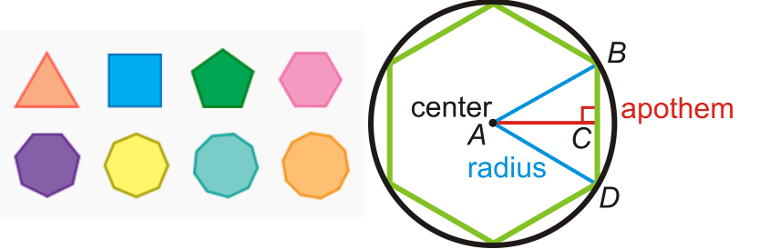

# Session 7a - Named Tuples

### [Class Notebook - Named Tuples](https://github.com/abdksyed/EPAi2/blob/main/Session07_Tuples_SequenceTypes/notebooks/Tuples.ipynb) 

### [Assignemnt Notebook](https://colab.research.google.com/drive/1a7o4ahOHZC9QOs4IYe2Xc12S9cyzbZwQ?usp=sharing)
Click on **Open in Colab** for hands-on.

### Topic Covered:

* #### Tuples as a Data Structure
* #### Named Tuple
* #### Named Tuple - Modifying & Extending
* #### Named Tuple - Doc String & Default Values

# Tuples & Named Tuples
A tuple is a collection which is ordered and **immutable**.  Python supports a type of container like dictionaries called `namedtuple`present in module, `collections`. Like dictionaries they contain keys that are hashed to a particular value. But on contrary, it supports both access from key value and iteration, the functionality that dictionaries lack.

## A note on Faker
**Faker** is a Python package that generates fake data for you. Faker has the ability to print/get a lot of different fake data, for instance, it can print fake name, address, email, text, etc. We make use of fake profiles and companies for our purpose.

```python
from faker import Faker
fake = Faker() # creating faker object

fake.profile() # generates a fake profile

fake.company() # generates a fake company name
```

## Profiles using named tuples and dictionaries

We have to use Faker library to get 10000 random profiles. Using named tuple, have to calculate the most frequently appearing blood type, mean current location of all the profiles, Profile with oldest person and the age and average age calculated from all the profiles. This has to be repeated using dictionaries instead of named tuples for runtime comparison.

To store the 10000 profiles, we make use of named tuple to store each profile. Then store 10000 of these in a list. Alternatively, we could have used tuple or named tuple. But it's not efficient to use them for this purpose. Reason being, each profile data is constant and hence won't change. But when we generate each profile, we add it to the list as named tuple. With this, we just add that extra memory to the list. But is we use named tuple or tuple instead, python will keep on creating new tuples every time we add another profile. That's highly inefficient. This way, if we create and add 10000 profiles one by one, we make 10000 different tuples in the memory.


To compare the runtime of both these ways to process the profiles, we make use of a decorator, which gives us the runtime for the functions. It is as follows:

```python
def timed(n: int) -> callable:
    '''
    function acts as a decorator factory which takes function repetation count
    as argument.
    returns the decorator
    '''
    def timed_inner(fn: callable) -> callable:
        '''
        function acts as a decorator which runs the given function for
        specified number of times using closure.
        returns the closure
        '''
        def inner(*args, **kwargs) -> tuple:
            '''
            Calculates the Average Time and Run the Funciton
            '''
            start = perf_counter()
            for _ in range(n):
                result = fn(*args, **kwargs)
            end = perf_counter()

            return result, f'Average Time to Run the Function is: {(end-start)/n :.3f}'

        return inner

    return timed_inner
```

In practical, we observe the following when we process the namedtuple profiles:

```
Named Tuple Result:  Stat(oldest_person=115, highest_blood=('AB-', 1300), mean_location=(Decimal('0.0350163466'), Decimal('0.2791915216')), average_age=57.4241)
Named Tuple Approach Average Time:  Average Time to Run the Function is: 178.215
```

and, when we repeat the same thing using dictionaries, we observe the following:

```
Dictionary Result:  {'oldest_person': 115, 'highest_blood': ('A+', 1304), 'mean_location': (Decimal('-0.3385817739'), Decimal('0.0082666902')), 'average_age': 57.2125}
Dictionary Approach Average Time:  Average Time to Run the Function is: 179.132
```

We observe that the named tuples are slightly faster. Though, this wasn't guaranteed. The dictionary approach did beat the namedtuple quite a few sometimes.

# TSE - TSAI Stock Exchange

 Welcome to TSAI Stock Exchange. Don't take it too seriously 😂, we don't have a license. The task here is to create a fake data (you can use Faker for company names) for imaginary stock exchange for top 100 companies (name, symbol, open, high, close). Assign a random weight to all the companies. Calculate and show what value stock market started at, what was the highest value during the day and where did it end. Make sure your open, high, close are not totally random.

Let's look at some of the listed stocks in our stock exchange.


Weights here define the weightage of that particular stock's value in calculation of the total valuation of the TSAIEX ( TSAI Index 😅). 

One instance of our Index is as follows for 10 Days:

TSAI_Index(open=[526, 494, 519, 505, 458, 485, 512, 505, 500, 555], high=[694, 633, 689, 648, 611, 631, 670, 665, 655, 728], low=[410, 394, 398, 404, 366, 386, 407, 404, 401, 433], close=[530, 503, 519, 511, 458, 479, 516, 513, 495, 552])

The Simulation of Index for 10 Days:


The functions to calculate the list of stocks and also, the index values can be found in the script. Here also, we make use of namedtuple to store each stock and a list to store all the namedtuples for the very same reason, described in the previous section.

# Session 7b - Sequence Types -I

### [Class Notebook - Sequnce Types](https://github.com/abdksyed/EPAi2/blob/main/Session07_Tuples_SequenceTypes/notebooks/SequenceTypes.ipynb)
### [Class Notebook - Custom Sequences](https://github.com/abdksyed/EPAi2/blob/main/Session07_Tuples_SequenceTypes/notebooks/CustomSequences.ipynb)

Click on **Open in Colab** for hands-on.

### [Assignment Notebook](https://colab.research.google.com/drive/1Pxxw9_-ycnh1-5bO-2SO3mmv0whUHd4p?usp=sharing)

### Topic Covered:

* #### Sequence Types
* #### Custom Seqeunces

# Sequence Types
In Math: S = x1, x2, x3...(countable sequence)  
Note the indices of sequence are 1,2,3,4....  

We can refer to any item in the sequence by it's index number. ex: S\[2](=x2)  
So we have a concept of first element, second element and so on, -> _positional ordering_

In Python Sequence is similiar object, which is having an order, but here the index starts from 0.

## Creating a Polygon Class.

A regular strictly convex polygon is a polygon that has the following characteristics:
* all interior angles are less than 180
* all sides have equal length


For a regular strictly convex polygon with:
n edges (=n vertices)
R circumradius
* interiorAngle = ( n − 2 ) ⋅ 180 n
* edgeLength, s = 2 ⋅ R ⋅ sin ⁡ ( π n )
* apothem, a = R ⋅ cos ⁡ ( π n )
* area = 1/2 ⋅ n ⋅ s ⋅ a
* perimeter = n ⋅ s

#### The class must have 
1. initializer which takes in:
    * number of edges/vertices
    * circumradius
2. That can provide these properties:
    * \# edges
    * \# vertices
    * interior angle
    * edge length
    * apothem
    * area
    * perimeter
3. That has these functionalities:
    * a proper \_\_repr__ function
    * implements equality (==) based on # vertices and circumradius (\_\_eq__)
    * implements > based on number of vertices only (\_\_gt__)

```python
class Polygon:
    def __init__(self, vertices: int, circumradius: float):
        if not isinstance(vertices, int):
            raise TypeError('Vertices must be of Type <int>')
        if not isinstance(circumradius, (float, int)):
            raise TypeError('Common Circumradius must be a number')
        if vertices < 3:
            raise ValueError('There must be atleast 3 Vertices for a Polygon')
        if circumradius <= 0:
            raise ValueError('Circumradius must be greater than 0')

        self._n = vertices
        self._r = circumradius

    @property
    def edges(self):
        return self._n

    @property
    def circumradius(self):
        return self._r

    @property
    def interior_angle(self):
        return (self._n - 2)*(180/self._n)

    @property
    def edge_len(self):
        return round(2*self._r*math.sin(math.pi/self._n), 3)

    @property
    def apothem(self):
        return self._r * math.cos(math.pi/self._n)

    @property
    def area(self):
        return 0.5*self._n * self.edge_len * self.apothem

    @property
    def perimeter(self):
        return self._n * self.edge_len

    def __repr__(self):
        return f'<Polygon Object at {hex(id(self))}> with {self._n} sides and Circmradius of {self._r}'

    def __eq__(self, other):
        if not isinstance(other, Polygon):
            raise TypeError(f'{other} Object must be of Type Polygon')
        return (self._n == other.edges) and (self._r == other.circumradius)

    def __gt__(self, other):
        if not isinstance(other, Polygon):
            raise TypeError(f'{other} Object must be of Type Polygon')
        return self._n > other.edges

    def __ge__(self, other):
        if not isinstance(other, Polygon):
            raise TypeError(f'{other} Object must be of Type Polygon')
        return self._n >= other.edges
```

## Creating a Custom Sequence
Implementing a Custom Polygon sequence type:
1. where initializer takes in:
    * number of vertices for largest polygon in the sequence
    * common circumradius for all polygons
2. that can provide these properties:
    * max efficiency polygon: returns the Polygon with the highest area: perimeter ratio
3. that has these functionalities:
    * functions as a sequence type (\_\_getitem__)
    * supports the len() function (\_\_len__)
    * has a proper representation (\_\_repr__)

```python
class PolySeq():
    def __init__(self, max_sides: int, common_circumradius: float):
        if not isinstance(max_sides, int):
            raise TypeError('Max Sides must be of Type <int>')
        if not isinstance(common_circumradius, (float, int)):
            raise TypeError('Common Circumradius must be a number')
        if max_sides < 3:
            raise ValueError('There must be atleast 3 Sides for a Polygon')
        if common_circumradius <= 0:
            raise ValueError('Common Circumradius must be greater than 0')

        self._n = max_sides
        self._r = common_circumradius

    def __len__(self):
        return self._n - 2

    @property
    def max_eff(self):
        eff = dict()
        for i in range(3, self._n+1):
            eff[self[i].area/self[i].perimeter] = i
        return {eff[max(eff)]: max(eff)}

    def __getitem__(self, s):
        if isinstance(s, int):
            # single item requested
            if s < 0:
                s = self._n
            if s < 3 or s > self._n:
                raise IndexError(
                    f'Index for this Sequence begins at 3 and ends at {self._n}')
            return Polygon(s, self._r)
        else:
            # slice being requested
            idx = s.indices(self._n)
            rng = range(idx[0], idx[1]+1, idx[2])
            return [self[n] for n in rng]
```

